# 将Web应用运行于EKS
本实验活动通过动手实践的方式帮助您了解EKS，您将体验到如下：
1. 通过eksctl创建EKS集群
3. 发布Web饮用
4. 配置自动扩展功能
5. EKS集群监控
6. 通过FluentBit收集K8s日志以及应用日志

# 准备工作
## Cloud9创建及配置
在这一节，我们将在AWS帐号下创建Cloud9 IDE，作为后续实验的代码编辑工具
### 1. 在AWS控制台上，搜索Cloud9服务

### 2. 在Cloud9控制台，点击Create environment
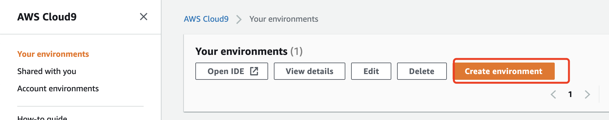
### 3. 输入环境的名称（如eks-lab）和描述
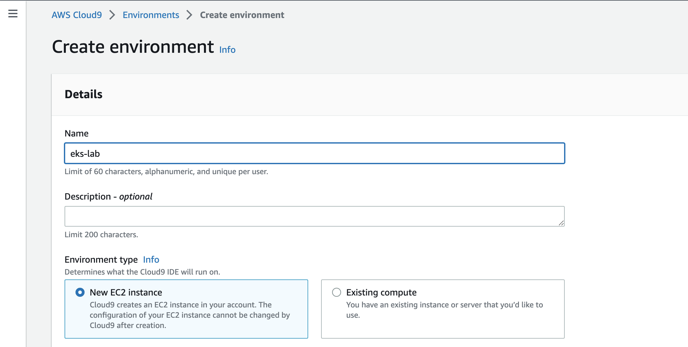
### 4. 点击进入下一步。在Configure settings步骤, 机型型号选择m5.large，然后点击Next step：
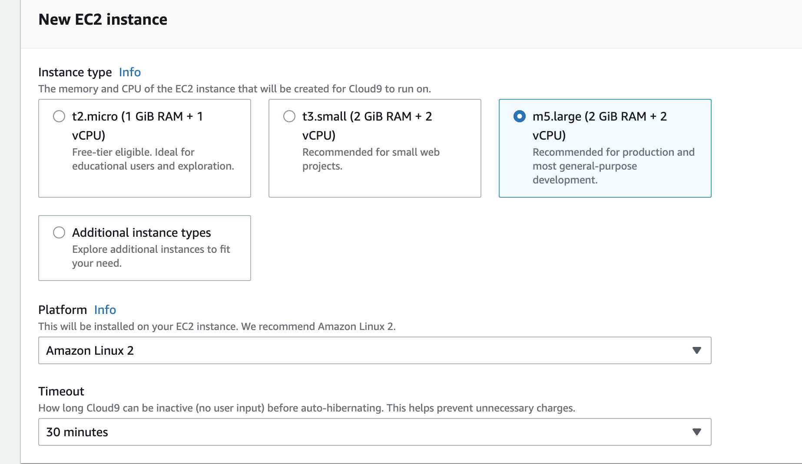
### 5. 进入下一步，并点击Create Environment创建Cloud9, 整个创建过程会持续大概2-3分钟

## 创建IAM Role
### 1. 进入IAM服务，在角色部分，点击创建角色
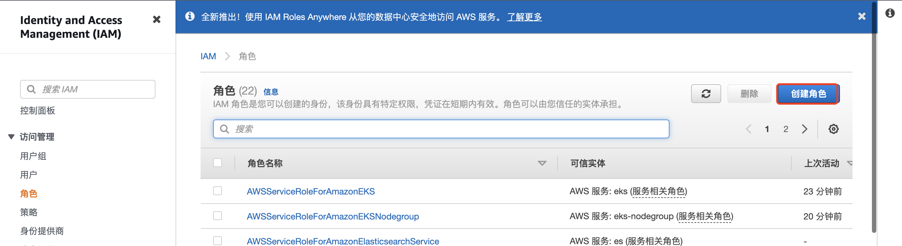
### 2. 选择EC2做为可信实体
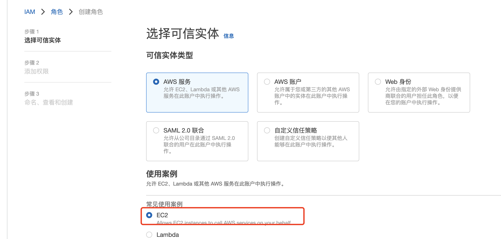
### 3. 进入下一步，添加AdministratorAccess权限
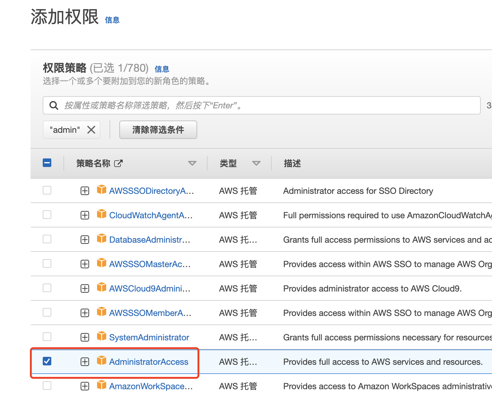
### 4. 进入下一步，为角色命名为eks-workshop，并点击创建
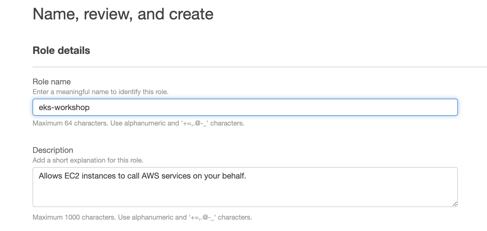

## 将role绑定到Cloud9 
### 1. 进入到Cloud 9页面，在Cloud9页面，点击Manage EC2 Instance
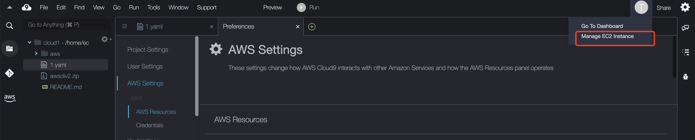
### 2. 会进入EC2页面，为Cloud9所在机器绑定上面创建的IAM角色
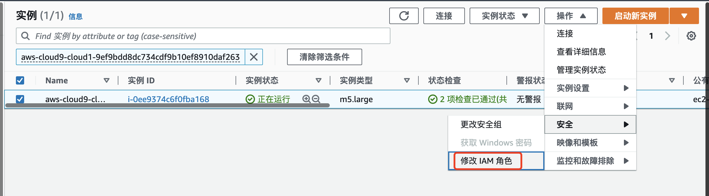
选择刚才所建的Role eks-workshop
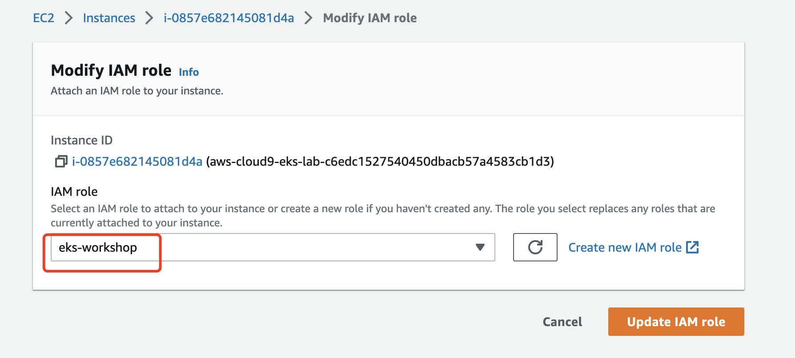

### 3. Cloud9默认使用自己的Role，我们需要先将其禁掉
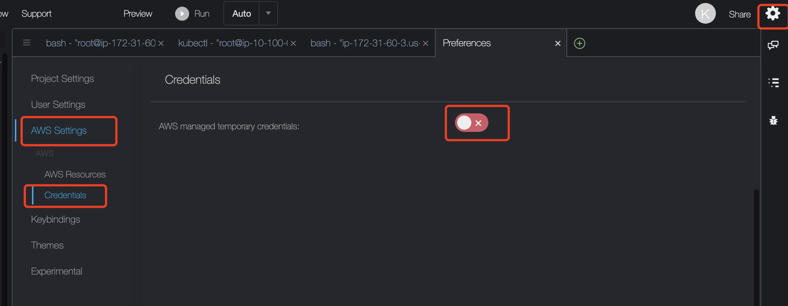

### 4. 删除临时credentials
在命令行控制台执行以下语句：
```bash
rm -vf ${HOME}/.aws/credentials
```

再执行以下命令，
```bash
aws sts get-caller-identity
```
控制台会输出上面创建的role eks-workshop:

## 安装相关软件
设置好Cloud9环境之后，点击"Open"进入Cloud9 IDE
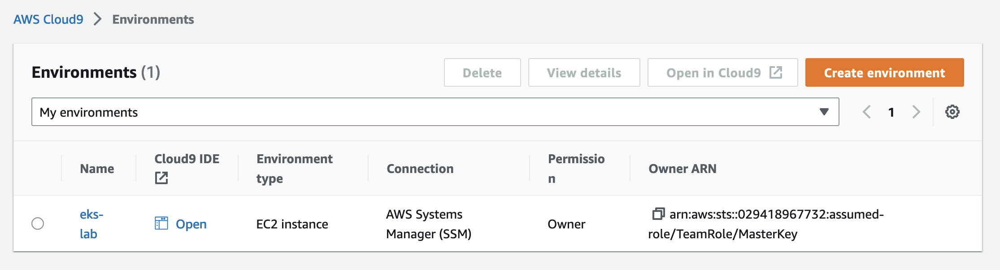
通过Cloud9的Terminal执行以下命令：

```bash
git clone https://github.com/mingdche/web-app-on-eks-workshop 

cd web-app-on-eks-workshop

./init.sh
```

以上命令为我们安装了以下软件：`kubectl`, `eksctl`, `helm`客户端，并配置了后续脚本命令所需的环境变量 `AWS_REGION`，`ACCOUNT_ID` 

# 创建EKS集群
## 创建EKS集群
获取当前Region:
```bash

AWS_REGION=`curl http://169.254.169.254/latest/dynamic/instance-identity/document|grep region|awk -F\" '{print $4}'`

```
使用以下命令，通过eksctl创建一个EKS集群：

```bash
cat > eks-cluster.yaml <<EOF
apiVersion: eksctl.io/v1alpha5
kind: ClusterConfig

metadata:
  name: eks-lab
  region: ${AWS_REGION}

managedNodeGroups:
  - name: managed-ng-1
    minSize: 2
    maxSize: 4
    desiredCapacity: 2
    volumeSize: 20
    iam:
      withAddonPolicies:
        externalDNS: true
        certManager: true
        ebs: true
EOF
```
```bash
eksctl create cluster -f eks-cluster.yaml
```
等待大概15分钟左右，集群创建完成。

## 访问刚才创建的集群

您可以运行kubectl get nodes以验证是否能正常访问集群
```bash
kubectl get nodes
```

# 在EKS上部署简单的Web应用
## 将应用打包成为Docker镜像
```bash
curl -o- https://raw.githubusercontent.com/nvm-sh/nvm/v0.34.0/install.sh | bash
```

```bash
. ~/.nvm/nvm.sh
```

```bash
nvm install --lts
```

```bash
mkdir app && cd app
```


```bash
npx express-generator # press y
```

将以上应用通过Dockerfile打包成一个Docker镜像，在app目录下执行以下语句创建Dockerfile文件
```bash
cat > Dockerfile <<EOF
FROM node:14

# Install app dependencies
# A wildcard is used to ensure both package.json AND package-lock.json are copied
# where available (npm@5+)
COPY package*.json ./

RUN npm install
# If you are building your code for production
# RUN npm ci --only=production

# Bundle app source
COPY . .

EXPOSE 3000
CMD [ "node", "./bin/www" ]
EOF
```

打包Docker镜像

```bash
docker build -t front-end .
```

检查一下新建的Docker镜像

```bash
docker images
```

## 将应用镜像推送到ECR私有镜像仓库

### 1.  登录ECR镜像仓库
```bash
aws ecr get-login-password --region ${AWS_REGION} | docker login --username AWS --password-stdin ${ACCOUNT_ID}.dkr.ecr.${AWS_REGION}.amazonaws.com
```
### 2. 创建名为front-end的镜像仓库
```bash
aws ecr create-repository \
    --repository-name front-end \
    --image-scanning-configuration scanOnPush=true \
    --region ${AWS_REGION}
```
### 3. 给Docker打标签
```bash
docker tag front-end:latest ${ACCOUNT_ID}.dkr.ecr.${AWS_REGION}.amazonaws.com/front-end:latest
```

### 4. 将镜像push到镜像仓库
```bash
docker push ${ACCOUNT_ID}.dkr.ecr.${AWS_REGION}.amazonaws.com/front-end:latest
```

### 5. 部署应用
在app目录下执行以下命令，它将生成deploy.yaml文件
```bash
cat > deploy.yaml <<EOF
apiVersion: v1
kind: Namespace # create the namespace for this application
metadata:
  name: front-end
---
apiVersion: apps/v1
kind: Deployment 
metadata:
  name: front-end-deployment
  namespace: front-end
spec:
  selector:
    matchLabels:
      app: front-end
  template:
    metadata:
      labels:
        app: front-end
    spec:
      containers:
      - name: front-end
        image: ${ACCOUNT_ID}.dkr.ecr.${AWS_REGION}.amazonaws.com/front-end:latest # specify your ECR repository
        ports:
        - containerPort: 3000 
        resources:
            limits:
              cpu: 500m
            requests:
              cpu: 250m
---
apiVersion: v1
kind: Service
metadata:
  name: front-end-service
  namespace: front-end
  labels:
    app: front-end
spec:
  selector:
    app: front-end
  ports:
    - protocol: TCP
      port: 3000 
      targetPort: 3000
  type: NodePort # expose the service as NodePort type so that ALB can use it later.
EOF
```

通过以下命令创建`front-end`命名空间、`front-end`部署以及`front-end-service`服务

```bash
kubectl apply -f deploy.yaml
```

执行以下命令将看到部署的情况
```bash
kubectl get pods -n front-end
```

## 将应用曝露在互联网上
在上述步骤中，我们创建了名为front-end-service的服务，仅创建服务还不够，为了让互联网上的流量能够访问到我们刚才部署的服务，我们需要部署aws-load-balancer-controller.

### 1. 部署aws-load-balancer-controller

#### 1. 创建IAM Policy
```bash
curl -o iam_policy.json https://raw.githubusercontent.com/kubernetes-sigs/aws-load-balancer-controller/v2.4.4/docs/install/iam_policy.json

aws iam create-policy \
    --policy-name AWSLoadBalancerControllerIAMPolicy \
    --policy-document file://iam_policy.json

```
#### 2. 创建IRSA
```bash
eksctl utils associate-iam-oidc-provider --region=us-east-1 --cluster=eks-lab --approve

eksctl create iamserviceaccount \
  --cluster=eks-lab \
  --namespace=kube-system \
  --name=aws-load-balancer-controller \
  --role-name "AmazonEKSLoadBalancerControllerRole" \
  --attach-policy-arn=arn:aws:iam::${ACCOUNT_ID}:policy/AWSLoadBalancerControllerIAMPolicy \
  --approve
```

#### 3. 通过Helm安装
```bash
helm repo add eks https://aws.github.io/eks-charts

helm repo update


helm install aws-load-balancer-controller eks/aws-load-balancer-controller \
  -n kube-system \
  --set clusterName=eks-lab \
  --set serviceAccount.create=false \
  --set serviceAccount.name=aws-load-balancer-controller 
```

### 2. 打印出公共子网的子网ID, 这些子网ID在创建ingress的时候有用
```bash
aws ec2 describe-subnets --filters "Name=tag:Name,Values=eksctl-eks-lab-cluster/SubnetPublic*"| jq -r .Subnets[].SubnetId  
```
将上面的Subnet Id保存到2个或3个变量中，以逗号分隔
```bash
export PUBLIC_SUBNETS_IDS=<将上面的Subnet Id保存到2个或3个变量中，以逗号分隔>  
```


### 3. 创建ingress配置文件

在app目录执行一下命令将会在app目录生成ingress.yaml文件
```bash
cat > ingress.yaml <<EOF
apiVersion: networking.k8s.io/v1
kind: Ingress
metadata:
  namespace: front-end
  name: ingress-front-end
  annotations:
    kubernetes.io/ingress.class: alb
    alb.ingress.kubernetes.io/scheme: internet-facing
    alb.ingress.kubernetes.io/target-type: ip # using IP routing policy of ALB
    alb.ingress.kubernetes.io/subnets: $PUBLIC_SUBNETS_IDS
spec:
  rules:
    - http:
        paths:
          - path: /
            pathType: Prefix
            backend:
              service:
                name: front-end-service # refer to the service defined in deploy.yaml
                port:
                  number: 3000
EOF
```
### 4. 执行以下语句创建ingress对象
```bash
kubectl apply -f ingress.yaml
```

查看Ingress对象状态
```bash
kubectl describe ingress ingress-front-end -n front-end
```

执行下面语句将显示我们创建的ingress对象

```bash
kubectl get ing -n front-end
```

### 5. 打印出ALB的地址，通过该地址访问应用（域名生效需要时间，请耐心等待）
```bash
echo "http://$(kubectl get ing -n front-end --output=json | jq -r .items[].status.loadBalancer.ingress[].hostname)"
```

# 体验EKS的自动扩展功能

## 安装Metrics Server
Metrics Server 监控容器内的资源使用情况，用于给HPA提供指标数据。
部署Metrics Server：
```bash
kubectl apply -f https://github.com/kubernetes-sigs/metrics-server/releases/download/v0.5.0/components.yaml
```

等待1-2分钟后，确认metric-server的状态变为True：
```bash
kubectl get apiservice v1beta1.metrics.k8s.io -o json | jq '.status'
```


## 部署HPA
创建HPA规则，当CPU超过10%的时候，HPA会扩容pod:
```bash
cat > front-end-hpa.yaml <<EOF
apiVersion: autoscaling/v1
kind: HorizontalPodAutoscaler
metadata:
  name: front-end-hpa
  namespace: front-end
spec:
  scaleTargetRef:
    apiVersion: apps/v1
    kind: Deployment
    name: front-end-deployment
  minReplicas: 1 
  maxReplicas: 100
  targetCPUUtilizationPercentage: 10 # define the replicas range and the scaling policy for the deployment
EOF
```

```bash
kubectl apply -f front-end-hpa.yaml
```

为了观测pod的变化以及hpa的变化，我们在一个Cloud9页面打开3个命令终端，分别输入一下命令：

### 1. 监控Pod的数量变化
```bash
watch kubectl get pods -n front-end
```

### 2. 监控HPA
```bash
watch kubectl get hpa -n front-end
```

### 3. 执行压力测试
```bash
ab -c 500 -n 30000 http://$(kubectl get ing -n front-end --output=json | jq -r .items[].status.loadBalancer.ingress[].hostname)/
```

可以看出随着流量的增加，HPA的指标也在变化，随着HPA中CPU利用率的增加，Pod的数量也在增加

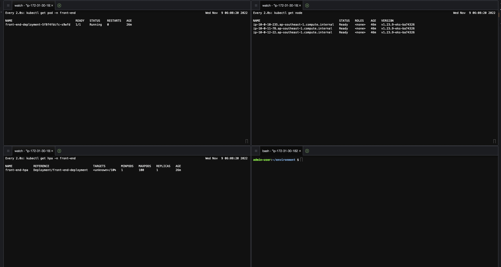

##  配置Cluster Autoscaler 
在我们创建集群的时候，已经把ASG最大节点数量设置成了4：

```bash
aws autoscaling \
    describe-auto-scaling-groups \
    --query "AutoScalingGroups[? Tags[? (Key=='eks:cluster-name') && Value=='eks-lab']].[AutoScalingGroupName, MinSize, MaxSize,DesiredCapacity]" \
    --output table  --region ${AWS_REGION}
```
在创建完成EKS节点组后，节点数量的最大值和最小值依然可以调整。这里我们先不进行操作

##  创建IAM Role  
由于Cluster Autoscaler要修改ASG，扩大或缩小机器的数量，所以它需要访问ASG对应的权限。在EKS里可以将IAM Role与service account绑定，这样权限控制的粒度可以精确到pod级别。

先在集群上开启IRSA(IAM roles for service accounts):
```bash
eksctl utils associate-iam-oidc-provider \
    --cluster eks-lab --region ${AWS_REGION} \
    --approve
```
创建policy，用于给后面CA使用：
```bash
mkdir ~/environment/cluster-autoscaler

cat <<EoF > ~/environment/cluster-autoscaler/k8s-asg-policy.json
{
    "Version": "2012-10-17",
    "Statement": [
        {
            "Action": [
                "autoscaling:DescribeAutoScalingGroups",
                "autoscaling:DescribeAutoScalingInstances",
                "autoscaling:DescribeLaunchConfigurations",
                "autoscaling:DescribeTags",
                "autoscaling:SetDesiredCapacity",
                "autoscaling:TerminateInstanceInAutoScalingGroup",
                "ec2:DescribeLaunchTemplateVersions"
            ],
            "Resource": "*",
            "Effect": "Allow"
        }
    ]
}
EoF
```

```bash
aws iam create-policy   \
  --policy-name k8s-asg-policy \
  --policy-document file://~/environment/cluster-autoscaler/k8s-asg-policy.json
```


创建IRSA：
```bash
export ACCOUNT_ID=$(aws sts get-caller-identity --query Account --output text)

eksctl create iamserviceaccount \
    --name cluster-autoscaler \
    --namespace kube-system \
    --cluster eks-lab --region ${AWS_REGION} \
    --attach-policy-arn "arn:aws:iam::${ACCOUNT_ID}:policy/k8s-asg-policy" \
    --approve \
    --override-existing-serviceaccounts
```
查看service account，它在Annotations声明了与role的绑定：
```bash
kubectl -n kube-system describe sa cluster-autoscaler
```

## 部署 Cluster Autoscaler (CA) 
部署Cluster Autoscaler：
```bash
wget https://pingfan.s3.amazonaws.com/files/cluster-autoscaler-autodiscover.yaml

kubectl apply -f cluster-autoscaler-autodiscover.yaml
```

为了防止CA把自己所在的node终止，我们先把这个特性关掉：
```bash
kubectl -n kube-system \
    annotate deployment.apps/cluster-autoscaler \
    cluster-autoscaler.kubernetes.io/safe-to-evict="false"
```

autoscaler的镜像版本需要和k8s版本一致，运行以下命令获取k8s版本，然后把CA的镜像更新：

```bash
# we need to retrieve the latest docker image available for our EKS version
export K8S_VERSION=$(kubectl version --short | grep 'Server Version:' | sed 's/[^0-9.]*\([0-9.]*\).*/\1/' | cut -d. -f1,2)
export AUTOSCALER_VERSION=$(curl -s "https://api.github.com/repos/kubernetes/autoscaler/releases" | grep '"tag_name":' | sed -s 's/.*-\([0-9][0-9\.]*\).*/\1/' | grep -m1 ${K8S_VERSION})

kubectl -n kube-system \
    set image deployment.apps/cluster-autoscaler \
    cluster-autoscaler=k8s.gcr.io/k8s-artifacts-prod/autoscaling/cluster-autoscaler:v${AUTOSCALER_VERSION}
```
等待1分钟后，查看CA的deploy状态, 确保正常运行：

```bash
kubectl get deploy -n kube-system
```

#  EKS集群监控
在本节我们将部署Prometheus + Grafana来监控EKS集群

## 更新helm
添加这两个工具的repo：
```bash
# add prometheus Helm repo
helm repo add prometheus-community https://prometheus-community.github.io/helm-charts

# add grafana Helm repo
helm repo add grafana https://grafana.github.io/helm-charts
```

## 安装CSI 
由于部署prometheus时需要使用额外的EBS来存储抓取的数据，所以先安装EBS CSI Driver。EBS CSI Driver让EKS能够以pv形式管理整个EBS的生命周期。

### 1. 配置IAM Policy 
 EBS CSI driver以pod形式部署在k8s里，它需要有访问EBS的权限(如创建、删除EBS)，所以我们第一步是创建policy和IRSA以给它授权

 创建IAM Policy：
 ```bash
export EBS_CSI_POLICY_NAME="Amazon_EBS_CSI_Driver"
export AWS_REGION=`curl http://169.254.169.254/latest/dynamic/instance-identity/document|grep region|awk -F\" '{print $4}'`

cd ~environment
# download the IAM policy document
curl -sSL -o ebs-csi-policy.json https://raw.githubusercontent.com/kubernetes-sigs/aws-ebs-csi-driver/master/docs/example-iam-policy.json

# Create the IAM policy
aws iam create-policy \
  --region ${AWS_REGION} \
  --policy-name ${EBS_CSI_POLICY_NAME} \
  --policy-document file://${HOME}/environment/ebs-csi-policy.json

# export the policy ARN as a variable
export EBS_CSI_POLICY_ARN=$(aws --region ${AWS_REGION} iam list-policies --query 'Policies[?PolicyName==`'$EBS_CSI_POLICY_NAME'`].Arn' --output text)
 ```

### 2. 创建IRSA 

 ```bash
# Create a service account
eksctl create iamserviceaccount \
  --cluster eks-lab --region ${AWS_REGION} \
  --name ebs-csi-controller-irsa \
  --namespace kube-system \
  --attach-policy-arn $EBS_CSI_POLICY_ARN \
  --override-existing-serviceaccounts \
  --approve
```

### 3. 部署Amazon EBS CSI Driver 
使用 helm部署EBS CSI Driver：
 ```bash
# add the aws-ebs-csi-driver as a helm repo
helm repo add aws-ebs-csi-driver https://kubernetes-sigs.github.io/aws-ebs-csi-driver

helm upgrade --install aws-ebs-csi-driver \
  --version=1.2.4 \
  --namespace kube-system \
  --set serviceAccount.controller.create=false \
  --set serviceAccount.snapshot.create=false \
  --set enableVolumeScheduling=true \
  --set enableVolumeResizing=true \
  --set enableVolumeSnapshot=true \
  --set serviceAccount.snapshot.name=ebs-csi-controller-irsa \
  --set serviceAccount.controller.name=ebs-csi-controller-irsa \
  aws-ebs-csi-driver/aws-ebs-csi-driver

kubectl -n kube-system rollout status deployment ebs-csi-controller
```

## 部署Prometheus 
运行以下命令：
 ```bash
kubectl create namespace prometheus

helm repo add prometheus-community https://prometheus-community.github.io/helm-charts

helm install prometheus prometheus-community/prometheus \
    --namespace prometheus \
    --set alertmanager.persistentVolume.storageClass="gp2" \
    --set server.persistentVolume.storageClass="gp2"
```

查看prometheus的状态：

 ```bash
kubectl get all -n prometheus
```

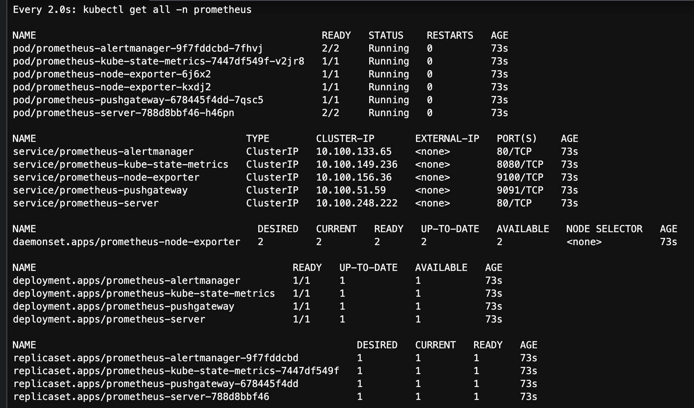

等待所有资源状态变为 Ready 或 Running：


# EKS日志


