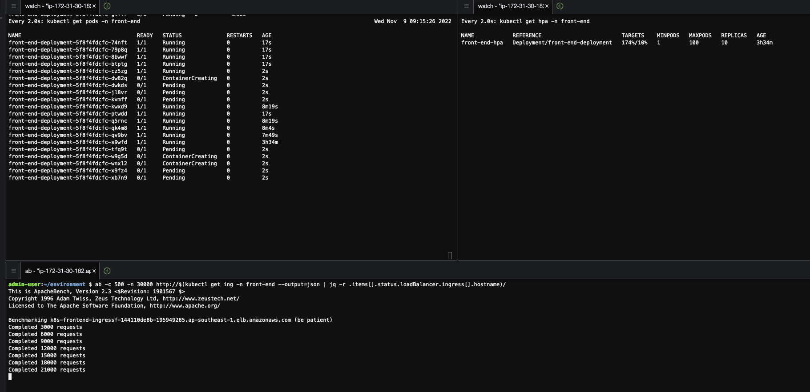

# 将Web应用运行于EKS
本实验活动通过动手实践的方式帮助您了解EKS，您将体验到如下：
1. 通过terraform创建EKS集群
3. 配置监控和观测功能
4. 部署简单的Web应用
5. 配置自动扩展功能
6. 通过FluentBit收集K8s日志以及应用日志

# 准备工作
### 安装相关软件
```bash
git clone https://github.com/mingdche/web-app-on-eks-workshop 

cd web-app-on-eks-workshop

./init.sh
```

以上命令为我们安装了以下软件：`kubectl`, `eksctl`, `helm`客户端，并安装了`Terraform` 并配置了后续脚本命令所需的环境变量 `AWS_REGION`，`ACCOUNT_ID` 

# 安装EKS集群
### 1. 安装
执行以下命令将为我们在一个新创的独立VPC中创建一个EKS集群，在main.tf文件中的vpc模块，我们可以看到VPC的相关配置
```bash
terraform init

terraform plan

terraform apply --auto-approve
```
集群创建大约花费15分钟

### 2. 访问刚才创建的集群
部署完成后，在命令的输出中可以看到类似于
configure_kubectl = "aws eks --region ap-southeast-1 update-kubeconfig --name web-app-on-eks-workshop"的命令

执行该命令就可以通过kubectl访问集群
```bash
aws eks --region ap-southeast-1 update-kubeconfig --name web-app-on-eks-workshop
```

您可以运行kubectl get nodes以验证是否能正常访问集群
```bash
kubectl get nodes
```

# 配置EKS的监控和观测功能
### 配置Addon
将以下配置添加到模块eks_blueprints_kubernetes_addons中

enable_aws_cloudwatch_metrics         = true

然后执行以下语句，它会更新集群的配置，为我们添加EKS的监控和观测功能
```bash
terraform init

terraform plan

terraform apply --auto-approve
```
### 监控和观测
访问CloudWatch Container Insights
打开CloudWatch控制台 -> Insights -> Container Insights


# 在EKS上部署简单的Web应用
### 1. 将应用打包成为Docker镜像
```bash
curl -o- https://raw.githubusercontent.com/nvm-sh/nvm/v0.34.0/install.sh | bash
```

```bash
. ~/.nvm/nvm.sh
```

```bash
nvm install --lts
```

```bash
mkdir app && cd app
```


```bash
npx express-generator
```

将以上应用通过Dockerfile打包成一个Docker镜像，在app目录下执行以下语句创建Dockerfile文件
```bash
cat > Dockerfile <<EOF
FROM node:14

# Install app dependencies
# A wildcard is used to ensure both package.json AND package-lock.json are copied
# where available (npm@5+)
COPY package*.json ./

RUN npm install
# If you are building your code for production
# RUN npm ci --only=production

# Bundle app source
COPY . .

EXPOSE 3000
CMD [ "node", "./bin/www" ]
EOF
```

打包Docker镜像

```bash
docker build -t front-end .
```

检查一下新建的Docker镜像

```bash
docker images
```

### 2. 将应用镜像推送到ECR私有镜像仓库

1.  登录ECR镜像仓库
```bash
aws ecr get-login-password --region ${AWS_REGION} | docker login --username AWS --password-stdin ${ACCOUNT_ID}.dkr.ecr.${AWS_REGION}.amazonaws.com
```
2. 创建名为front-end的镜像仓库
```bash
aws ecr create-repository \
    --repository-name front-end \
    --image-scanning-configuration scanOnPush=true \
    --region ${AWS_REGION}
```
3. 给Docker打标签
```bash
docker tag front-end:latest ${ACCOUNT_ID}.dkr.ecr.${AWS_REGION}.amazonaws.com/front-end
```

4. 将镜像push到镜像仓库
```bash
docker push ${ACCOUNT_ID}.dkr.ecr.ap-southeast-1.amazonaws.com/front-end
```

5. 部署应用
在app目录下执行以下命令，它将生成deploy.yaml文件
```bash
cat > deploy.yaml <<EOF
apiVersion: v1
kind: Namespace # create the namespace for this application
metadata:
  name: front-end
---
apiVersion: apps/v1
kind: Deployment 
metadata:
  name: front-end-deployment
  namespace: front-end
spec:
  selector:
    matchLabels:
      app: front-end
  template:
    metadata:
      labels:
        app: front-end
    spec:
      containers:
      - name: front-end
        image: ${ACCOUNT_ID}.dkr.ecr.ap-southeast-1.amazonaws.com/front-end # specify your ECR repository
        ports:
        - containerPort: 3000 
        resources:
            limits:
              cpu: 500m
            requests:
              cpu: 250m
---
apiVersion: v1
kind: Service
metadata:
  name: front-end-service
  namespace: front-end
  labels:
    app: front-end
spec:
  selector:
    app: front-end
  ports:
    - protocol: TCP
      port: 3000 
      targetPort: 3000
  type: NodePort # expose the service as NodePort type so that ALB can use it later.
EOF
```
通过以下命令创建`front-end`命名空间、`front-end`部署以及`front-end-service`服务

```bash
kubectl apply -f deploy.yaml
```

执行以下命令将看到部署的情况
```bash
kubectl get pods -n front-end
```

### 3. 将应用曝露在互联网上
在上述步骤中，我们创建了名为front-end-service的服务，仅创建服务还不够，为了让互联网上的流量能够访问到我们刚才部署的服务，我们需要部署aws-load-balancer-controller.

1. 添加Addon
我们在main.tf文件的module "eks_blueprints_kubernetes_addons" 添加一下语句
enable_aws_load_balancer_controller   = true
并执行
```bash
terraform init
terraform apply --auto-approve
```


2. export 公共子网的子网ID, 这些子网ID在创建ingress的时候有用
```bash
export PUBLIC_SUBNETS_ID_A=$(aws ec2 describe-subnets --filters "Name=tag:Name,Values=web-app-on-eks-workshop-public-${AWS_REGION}a" | jq -r .Subnets[].SubnetId)
export PUBLIC_SUBNETS_ID_B=$(aws ec2 describe-subnets --filters "Name=tag:Name,Values=web-app-on-eks-workshop-public-${AWS_REGION}b" | jq -r .Subnets[].SubnetId)
export PUBLIC_SUBNETS_ID_C=$(aws ec2 describe-subnets --filters "Name=tag:Name,Values=web-app-on-eks-workshop-public-${AWS_REGION}c" | jq -r .Subnets[].SubnetId)

```

3. 创建ingress配置文件
在app目录执行一下命令将会在app目录生成ingress.yaml文件
```bash
cat > ingress.yaml <<EOF
apiVersion: networking.k8s.io/v1
kind: Ingress
metadata:
  namespace: front-end
  name: ingress-front-end
  annotations:
    kubernetes.io/ingress.class: alb
    alb.ingress.kubernetes.io/scheme: internet-facing
    alb.ingress.kubernetes.io/target-type: ip # using IP routing policy of ALB
    alb.ingress.kubernetes.io/subnets: $PUBLIC_SUBNETS_ID_A, $PUBLIC_SUBNETS_ID_B, $PUBLIC_SUBNETS_ID_C # specifying the public subnets id
spec:
  rules:
    - http:
        paths:
          - path: /
            pathType: Prefix
            backend:
              service:
                name: front-end-service # refer to the service defined in deploy.yaml
                port:
                  number: 3000
EOF
```
4. 执行以下语句创建ingress对象
```bash
kubectl apply -f ingress.yaml
```

执行下面语句将显示我们创建的ingress对象

```bash
kubectl get ing -n front-end
```

5. 打印出ALB的地址，通过该地址访问应用（域名生效需要时间，请耐心等待）
```bash
echo "http://$(kubectl get ing -n front-end --output=json | jq -r .items[].status.loadBalancer.ingress[].hostname)"
```

# 体验EKS的自动扩展功能
### Pod的自动扩展
为了让HPA获取到Pod的指标实现自动扩容的目的，我们必须首先安装metrics server
```bash
kubectl apply -f https://github.com/kubernetes-sigs/metrics-server/releases/latest/download/components.yaml
```

然后部署HPA
```bash
cat > front-end-hpa.yaml <<EOF
apiVersion: autoscaling/v1
kind: HorizontalPodAutoscaler
metadata:
  name: front-end-hpa
  namespace: front-end
spec:
  scaleTargetRef:
    apiVersion: apps/v1
    kind: Deployment
    name: front-end-deployment
  minReplicas: 1 
  maxReplicas: 100
  targetCPUUtilizationPercentage: 10 # define the replicas range and the scaling policy for the deployment
EOF
```

```bash
kubectl apply -f front-end-hpa.yaml
```

为了观测pod的变化以及hpa的变化，我们在一个Cloud9页面打开3个命令终端，分别输入一下命令：

1. 监控Pod的数量变化
```bash
watch kubectl get pods -n front-end
```

2. 监控HPA
```bash
watch kubectl get hpa -n front-end
```

3. 执行压力测试
```bash
ab -c 500 -n 30000 http://$(kubectl get ing -n front-end --output=json | jq -r .items[].status.loadBalancer.ingress[].hostname)/
```

可以看出随着流量的增加，HPA的指标也在变化，随着HPA中CPU利用率的增加，Pod的数量也在增加



### 安装Kapenter
在上面的例子中，我们可以看到随着流量的持续加压，HPA会持续创建Pod，由于Node的数量有限，有些Pod处于Pending状态，这时候我们希望集群能够做到Node的自动扩展，Karpenter可以帮我们做到这一点。


# 通过FluentBit收集K8s日志以及应用日志


Loghub


